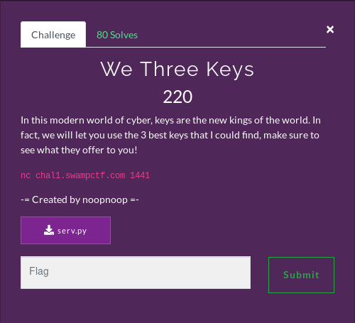
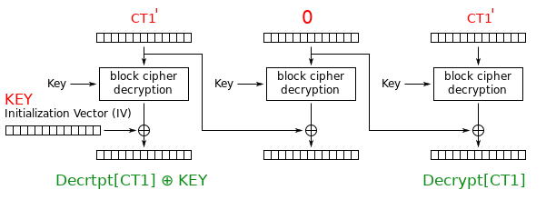

# We Three Keys



The challenge also provides the code used on the netcat server. I've redacted some code for legality purposes.

```python
#!/usr/bin/env python2
from Crypto.Cipher import AES
from keys import key1, key2, key3

def main():
    print("Hello! We present you with the future kings, we three keys!")
    print("Pick your key, and pick wisely!")
    key_opt = str(raw_input("<= "))
    if key_opt == "1":
        key = key1
    elif key_opt == "2":
        key = key2
    elif key_opt == "3":
        key = key3
    else:
        print("Come on, I said we have 3!")
        exit()
    while True:
        print("1) Encrypt a message")
        print("2) Decrypt a message")
        print("3) Choose a new key")
        print("4) Exit")
        choice = str(raw_input("<= "))
        if choice == "1":
            encrypt_message(key, key)
        elif choice == "2":
            decrypt_message(key, key)
        elif choice == "3":
            key = new_key()
        else:
            exit()


if __name__=='__main__':
    main()
```

The key element here is the use of the key as the IV!

```python
encrypt_message(key, key)
```

This opens up the encryption up to the ```key == IV``` attack.

### Exploit
Because we can choose plaintext we have a Chosen Plaintext Attack **CPA**.

The attack begins by encrypting at least 3 blocks of plaintext

```
AES_ENCRYPT(P1, P2, P3) = C1, C2, C3
```

Then taking the ```C1``` to produce a special payload

```
CT' = C1 0 C1
```

We then take this ciphertext and decrypt it.

This then gives us:

```
PT1' PT2' PT3'
```

And:

```
PT1' ⊕ PT3' == IV (Key)
```

This relationship is due to how AES-CBC mode operates.

By looking at the classic



This means when we XOR ```PT1'``` and ```PT3'```

```
(Decrypt[CT1] ⊕ KEY) ⊕ (Decrypt[CT1]) == KEY
```

Meaning we've been able to extract the key!

The exploit code can be seen below:

```python
from pwn import *
import re

def split_in_blocks(ct):
    return re.findall(".{32}", ct)

def hexXor(a, b):
    """
    Produces an XOR result of two equal length Hex values
    """

    if len(a) != len(b):
        raise("Error: incorrect length in hexXor")

    length = len(a)

    binA = bin(int(a, 16))[2:].zfill(length)
    binB = bin(int(b, 16))[2:].zfill(length)

    xor = int(binA, 2) ^ int(binB, 2)

    # Format ensures that the hex values are always the same length
    hexOutput = format(xor, f"#0{length + 2}x")[2:]

    return hexOutput

def get_key(keyNumber, payload):
    r.recvuntil("<= ")
    r.sendline(f"{keyNumber}")
    r.recvuntil("<= ")
    r.sendline("1")
    r.recvuntil("<= ")
    r.sendline(payload)

    ct = r.read().decode("utf-8")

    # Hacked cipher text
    ct_blocks = split_in_blocks(ct)
    ct_blocks[1] = "00" * 16
    ct_blocks[2] = ct_blocks[0]

    r.recvuntil("<= ")
    r.sendline("2")
    r.recvuntil("<= ")
    r.sendline("".join(ct_blocks))

    ct_prime = r.read().decode("utf-8")
    ct_prime_blocks = split_in_blocks(ct_prime)

    key = hexXor(ct_prime_blocks[0], ct_prime_blocks[2])
    
    r.recvuntil("<= ")
    r.sendline("3")

    return key

r = remote("chal1.swampctf.com", 1441)

# Creation of the faked CT
pt = "41" * 16
payload = pt + pt + pt

flag = ""
flag += get_key(1, payload)
flag += get_key(2, payload)
flag += get_key(3, payload)

print(flag)
```

This gives us the output:

```
666c61677b7730775f776834745f6c347a795f6b33797a5f6d7563685f7733346b5f6372797074305f6634316c73217d
```

When decode from hex gives us the flag:
```
flag{w0w_wh4t_l4zy_k3yz_much_w34k_crypt0_f41ls!}
```
